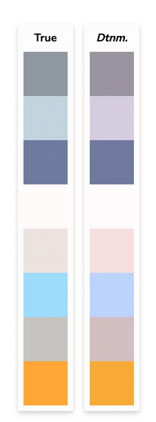

# ao-weather-widget

> A weather widget to get current weather is global cities

[](https://www.npmjs.com/package/ao-weather-widget) [](https://standardjs.com)

## Install

```bash
npm install --save ao-weather-widget
```

## Usage

```jsx
import React from 'react'
import WeatherWidget from 'ao-weather-widget'

const App = () => {
  return <WeatherWidget city='London' apiToken={process.env.REACT_APP_API_TOKEN} />
}

return default App
```
You can create an API Token using the OpenWeather pages here: https://home.openweathermap.org/api_keys

## Options

There are 3 configuration options for the WeatherWidget component:

- `city` (required): The city that should be used with the OpenWeatherAPI to get current weather data
- `apiToken` (required): The OpenWeather API Token that can be used to interact with the OpenWeatherAPI. You can create an account and generate an API key here: https://home.openweathermap.org/api_keys
- `fill`: Declares wether the component should fill the container it has been placed inside. Defaults to false.

## Development choices & assumptions

### NPM Package

I made the choice to develop this component and release it as a fully fledged NPM package to ease integration into other projects and to maintain a release history for future development

### SCSS

SCSS was used to build the styles for the WeatherWidget. The additional complexities that SCSS offers over standard CSS allows me to quickly build a set of classes for layouts, spacings and colors that be used site wide with ease.

### Standard JavaScript

I have chosen not to implement this version of the package with TypeScript as it is a small project with a single developer and also to speed up time to release. 

### Colorblindness

The most common type of color vision anomaly is deuteranomaly which involves reduced sensitivity. The colors used within the WeatherWidget have been chosen to limit the impact of this impairment.



## Future development

Future development tasks could include:

- A built in dropdown selector for the cities with data in the OpenWeatherAPi
- Additional configuration options for font styles, text colors and custom backgrounds
- A 3D globe with locations of the cities selected shown


## License

MIT © [AlphaOmeKilo](https://github.com/AlphaOmeKilo)
